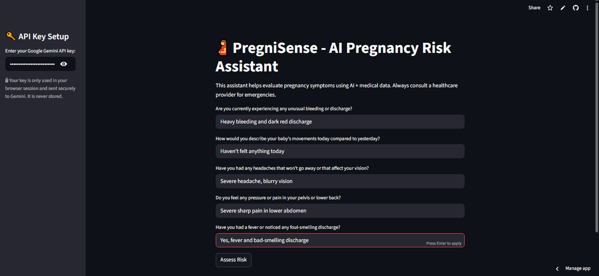
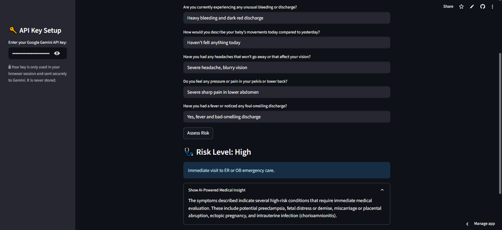

# 🤰 PregniSense – AI-Powered Pregnancy Risk Assistant

**PregniSense** is a proactive AI assistant designed to assess pregnancy-related symptoms and categorize them into Low, Medium, or High risk levels. Using a combination of medical knowledge (via Retrieval-Augmented Generation) and Gemini AI, it provides contextual medical insight and encourages users to seek proper care.

> ⚠️ **Disclaimer:** This tool is for educational and informational purposes only. It is not a substitute for professional medical advice, diagnosis, or treatment.

---

## 🌐 Live Demo

Click to try the app:
**[https://pregnisense-qqcw5pqqguqngvjvlivygh.streamlit.app/](https://pregnisense-qqcw5pqqguqngvjvlivygh.streamlit.app/)**

---

## 🏛️ Problem Statement

Pregnant women often experience a wide range of symptoms that may be normal or indicative of serious medical conditions. PregniSense helps:

* Categorize symptoms based on severity and risk.
* Retrieve relevant medical guidelines using RAG (Retrieval-Augmented Generation).
* Empower users with AI-generated advice in a friendly interface.

---

## ⚙️ Technologies Used

* **Python**
* **Streamlit** – frontend interface
* **LlamaIndex** – document loading, embedding, querying
* **Google Gemini (gemini-pro)** – LLM backend
* **HuggingFace Embeddings** – sentence-transformers/all-MiniLM-L6-v2

---

## 📋 Features

* Conversational chat interface (like ChatGPT)
* Step-by-step symptom collection
* Real-time risk classification: Low / Medium / High
* Gemini-powered AI medical insight with knowledge base (RAG)
* Expandable AI explanation box for clarity
* Gemini API key support via sidebar input
* Auto-indexing if no prebuilt vector index is found

---

## 📸 Screenshots

### Before Risk Assessment



### After Risk Assessment



---

## ⚡ Quickstart (Local)

### 1. Clone this repo:

```bash
git clone https://github.com/smebad/PregniSense.git
cd PregniSense
```

### 2. Set up environment

```bash
python -m venv venv
source venv/bin/activate  # or venv\Scripts\activate on Windows
pip install -r requirements.txt
```

### 3. Set up API key

Create a `.env` file:

```
GOOGLE_API_KEY=your_gemini_api_key_here
```

(Or use `st.sidebar` input in app)

### 4. Run the app

```bash
streamlit run app.py
```

---

## 📚 File Structure

```
PregniSense/
├── app.py                  → Streamlit app
├── classify.py             → Rule-based risk classification
├── index.py                → Builds index from knowledge base
├── data/                   → Medical reference documents
├── storage/                → (Auto-created on first run)
├── .env.example            → API key placeholder
├── .gitignore              → Keeps env and cache files out of git
├── requirements.txt
└── README.md
```

---

## 💡 How It Works

1. Loads medical knowledge from `data/*.txt`
2. Builds vector index using LlamaIndex + HuggingFace embeddings
3. User interacts with the assistant in a question-answer chat flow  
4. App classifies risk using logic-based rules
5. Passes full input to Gemini RAG engine for AI insight

---

## 🚫 License

This project is open-source under the **MIT License**. See `LICENSE` file.

You are free to fork, modify, and use it non-commercially with attribution.

---

## 👋 Contact

Developed by **Syed Muhammad Ebad**

For questions, collaboration or feedback, reach out via GitHub or LinkedIn!

---

If you like this project, please consider giving it a ⭐ on GitHub and sharing it on LinkedIn 📢!
